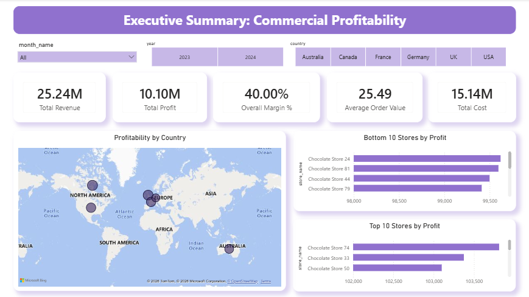
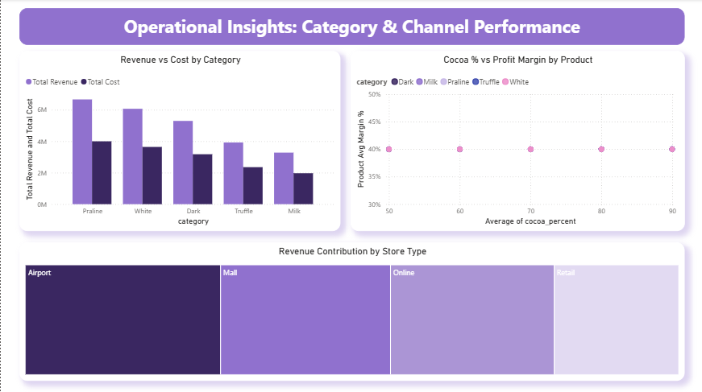
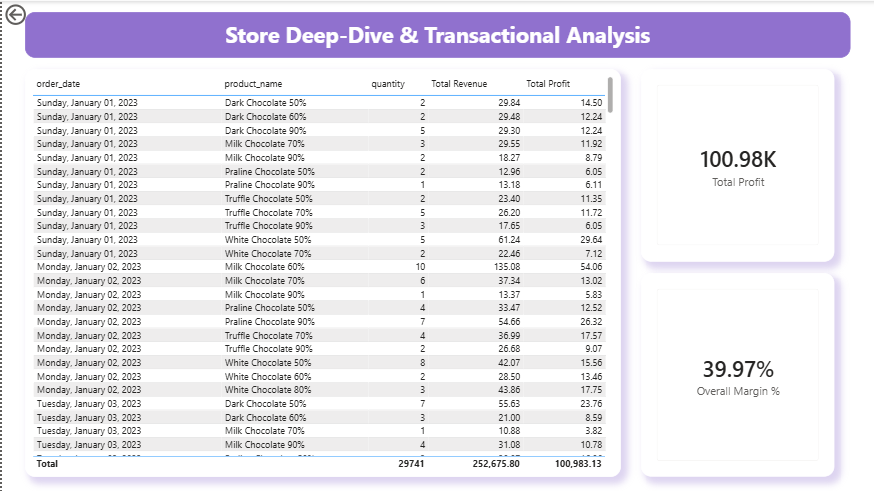

# Commercial Profitability & Product Strategy
### End-to-End Data Analysis Project — SQL (MySQL) + Power BI

📄 **[Read the full technical documentation →](docs/TECHNICAL_DOCUMENTATION.md)** *(detailed methodology, SQL logic, and statistical analysis for technical reviewers)*

---

## Executive Summary

Analysis of **990,236 validated transactions** (2023–2024) for a chocolate manufacturer operating **200 SKUs** across **100 stores** in **6 countries**. Management suspected that high-cocoa products were mispriced and that certain stores were structurally underperforming.

The data **did not support either hypothesis**. Gross margin remained consistently around **40%** across every product category, cocoa tier, and country. Discount depth also showed **no correlation** with sales volume in underperforming stores (Pearson r = 0.0047). The core recommendation is to shift strategic focus from margin optimization — already near-optimal — toward **volume and traffic growth**.

---

## Key Metrics

| KPI | Value |
|---|---|
| Total Revenue | $25,238,648.22 |
| Total Cost | $15,142,996.36 |
| Total Profit | $10,095,641.91 |
| Overall Gross Margin | 40.00% |
| Average Order Value | $25.49 |

---

## Business Questions & Answers

| # | Question | Answer |
|---|---|---|
| 1 | Revenue/cost/profit across categories? | Margin nearly identical across all 5 categories (39.98%–40.03%) |
| 2 | Does cocoa % affect margin? | No correlation — margin flat across cocoa tiers (40.00%–40.01%) |
| 3 | Which regions drive the most profit? | Canada leads (19.96% of revenue); margin is flat across all 6 countries (~40%) |
| 4 | Does discount drive volume in weak stores? | No — Pearson r = 0.0047 (negligible correlation) |

---

## Key Findings

- Pricing structure is highly consistent and healthy — no evidence of Dark Chocolate mispricing.
- Discounting is not an effective volume driver in underperforming stores.
- Top-performing stores win through higher volume, not superior margin efficiency.
- No store type (including Airport) is structurally underperforming at the population level.

## Recommendations

- **Short-term:** Do not raise Dark Chocolate prices; A/B test the discount policy instead.
- **Medium-term:** Shift growth strategy toward volume/traffic; audit low-performing stores for non-data operational causes (lease, staffing, competition).
- **Long-term:** Strengthen `product_id` validation at the source ERP/POS system.

---

## Dashboard Preview

**Executive Dashboard** — company-wide KPIs, geographic profitability map, Top/Bottom 10 stores


**Operational Dashboard** — category performance, cocoa % vs. margin, store-type contribution


**Store Deep-Dive** — transaction-level drill-through by store


---

## Tech Stack

`MySQL` · `SQL` (Window Functions, CTEs, Manual Pearson Correlation) · `Power BI` · `DAX`

## Repository Structure

```
/data       → schema description (raw data not published publicly)
/sql        → 5 sequential SQL scripts (setup → cleaning → analysis)
/dashboard  → Power BI (.pbix) file and screenshots
/docs       → full technical documentation
README.md
```

---

## Author

*[Your Name]* — Data Analyst Portfolio Project
